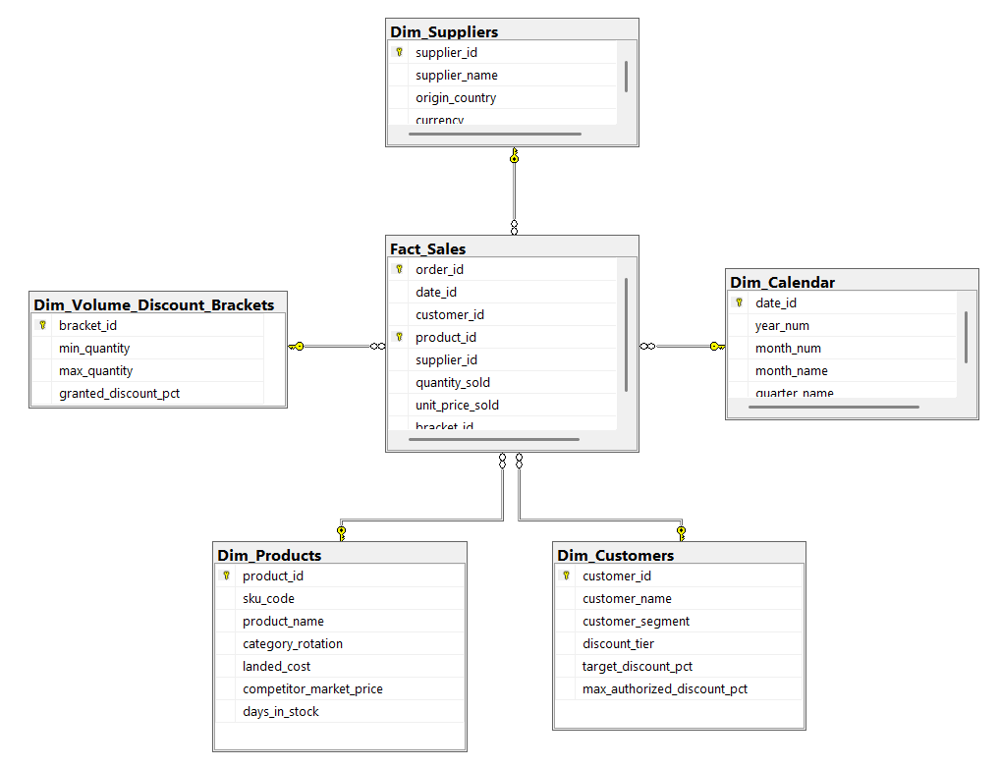

# 🏎️ Automotive Pricing Engine & Profitability Simulator

### 📋 Project Overview
This project is an end-to-end **Business Intelligence & Pricing Strategy** solution for an Automotive Spare Parts distributor. It tackles the entire data lifecycle: from managing chaotic supplier data and calculating complex landed costs in SQL, to detecting margin leakage and simulating pricing strategies in a highly interactive Power BI dashboard.

Instead of analyzing a flat, static dataset, this project builds a complete **Data Engineering & Analytics pipeline** from scratch.

### 💼 The Business Problem
The company faced three critical bottlenecks:
1. **Supplier Chaos:** Multiple vendors (Local & International) provided price lists in different formats, currencies, and naming conventions.
2. **Pricing Complexity:** Difficulty in determining the "Floor Price" (Minimum acceptable price) due to fluctuating import taxes and freight costs.
3. **Margin Leakage (The Silent Killer):** B2B Sales teams were granting excessive, unauthorized discounts to close deals, severely eroding the company's profitability without management visibility.

### 💡 The Solution & Dashboard Features
To solve this, I developed a 3-stage Power BI Dashboard driven by a robust SQL backend:

* **📊 Phase 1: Executive Overview** * Tracks high-level financial KPIs: Target Revenue, Actual Revenue, and Gross Margin distribution across B2B and B2C segments.
* **🕵️‍♂️ Phase 2: Margin Leakage Diagnostic**
  * **Price Walk (Waterfall Chart):** Mathematically isolates justified corporate discounts from unauthorized margin leakage (money given away by sales reps).
  * **Wall of Shame:** A Top 10 breakdown of the worst-performing clients where the company is losing the most margin.
* **🎛️ Phase 3: Strategic Pricing Simulator (What-If Analysis)**
  * **Interactive Calculator:** Allows management to simulate global price changes (-20% to +20%) and instantly see the dollar impact on the Gross Margin per SKU.
  * **Strategy Matrix (Scatter Plot):** Classifies the 750+ parts catalog into 4 quadrants (Volume vs. Profitability) to identify which SKUs can absorb a price hike and which require aggressive liquidation promotions.

### 🛠️ Tech Stack & Architecture
* **SQL Server (T-SQL):** Data ingestion, normalization (fuzzy logic for SKUs), and ETL processes to calculate `Landed_Cost` (FOB + Freight + Tariffs).
* **Power BI:** Data Modeling (Star Schema).
* **Advanced DAX:** Complex measure creation (Dynamic Pricing, Margin Leakage isolation, What-If parameters).
* **Data Strategy:** Hybrid Pricing Model (Competitor-based for High Rotation SKUs + Cost-Plus for Long Tail parts).

### 📊 Entity-Relationship Diagram

### 📂 Repository Structure
* `01_Market_Simulation_DDL.sql`: Script to generate the synthetic database and the Master Catalog.
* `02_Pricing_Logic_ETL.sql`: Stored procedures to clean data and calculate Landed Costs.
* `Dashboard_Pricing_Engine.pbix`: The final Power BI file containing the Star Schema model and DAX measures.
* `Pricing_Dashboard_Presentation.pdf`: A static export of the dashboard for quick viewing.

### 🚀 How to Explore This Project
1. 📄 **[View the Dashboard PDF here](link_to_your_pdf)** to see the final visual results.
2. 💻 Download the `.pbix` file to interact with the DAX formulas and the Pricing Simulator.
3. 🗄️ Run the `.sql` scripts in SSMS to see the ETL logic that feeds the dashboard.

---
*Author: Aaron Olmedo*
*Role: Data Analyst / BI Developer*